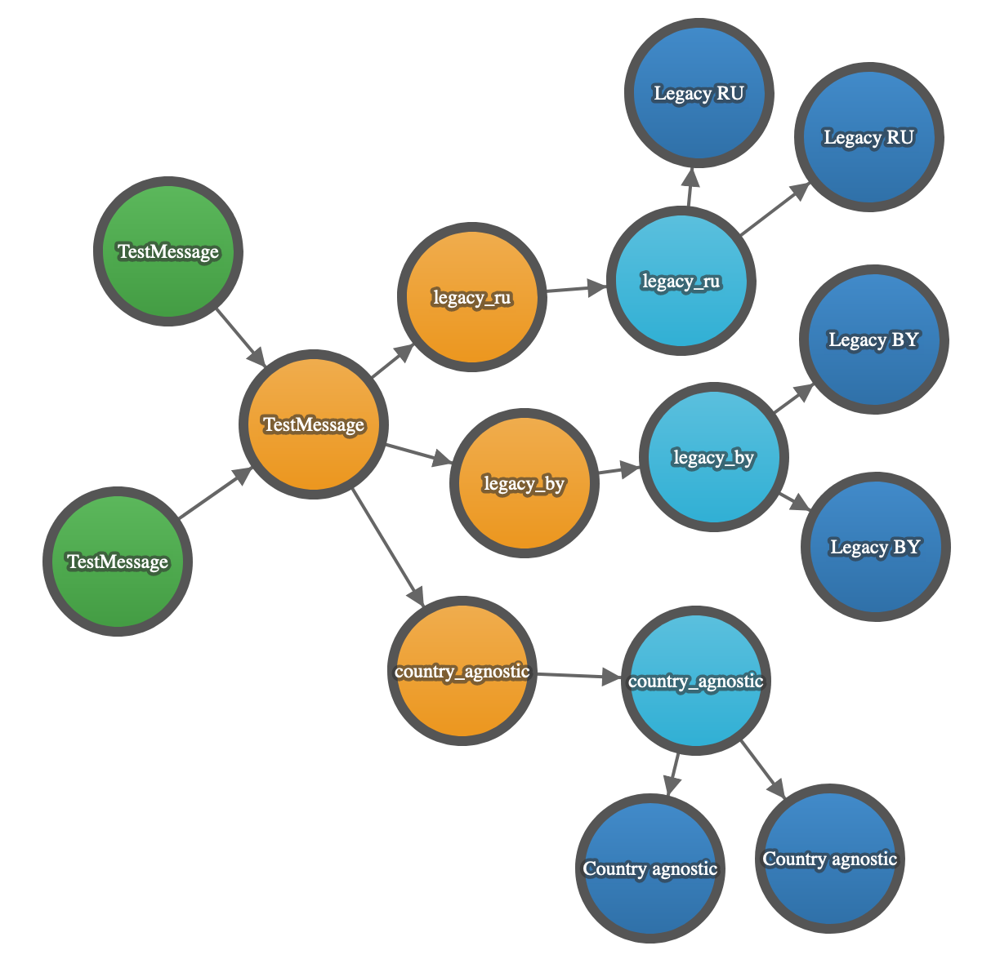
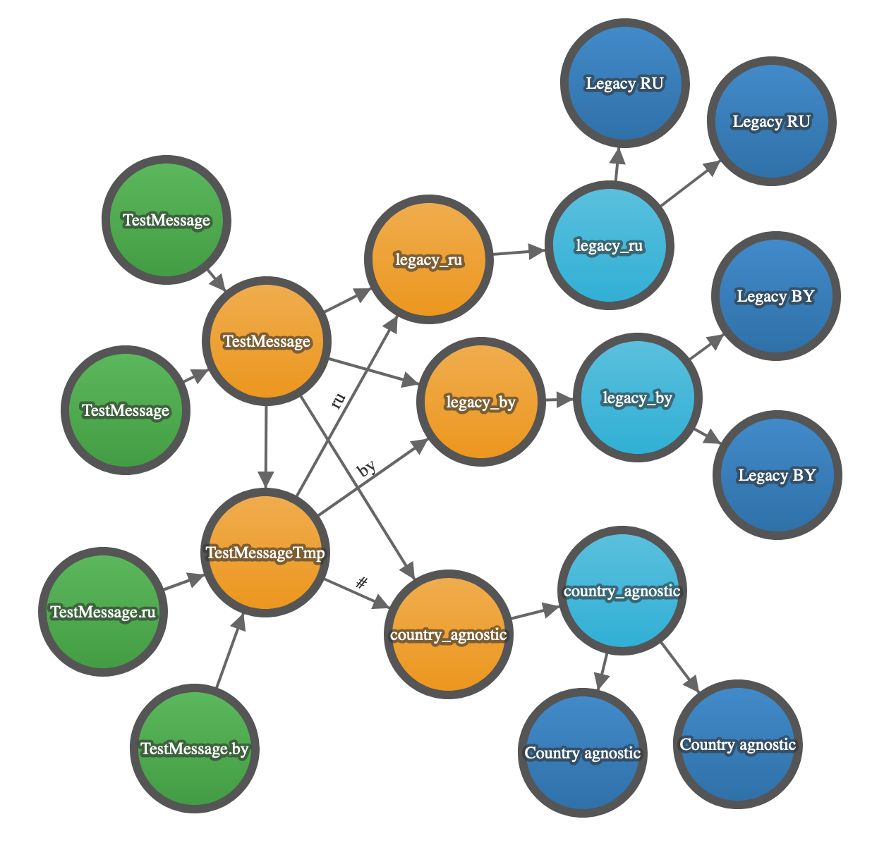

# MassTransit RabbitMQ scheme migration example

Pretty simple example of change type of exchange from fanout to topic using MassTransit.

## Getting Started

Initialize RabbitMQ
```
docker-compose up -d
```
Run consumers
```
dotnet run -p ./src/Example.Consumer
```
Run producer
```
dotnet run -p ./src/Example.Producer
```

## Steps

### Initial state
```
dotnet run -p ./src/Example.Producer --initial
```
Producer 0 started.


### First step
```
dotnet run -p ./src/Example.Producer
```
Add temporary exchange and bindings.

Producer 1 started. Producer 0 worked for a while then stopped.

It imitates rolling update.


### Second step 1st part
Producer 0 should be stopped at this time!
```
dotnet run -p ./src/Example.Producer --second
```
Delete original exchange


### Second step 2nd part
Recreate exchange with original name and topic scheme


### Third step
Here we can stop Producer 1.

Manual (or automatic) clear temporary exchange
