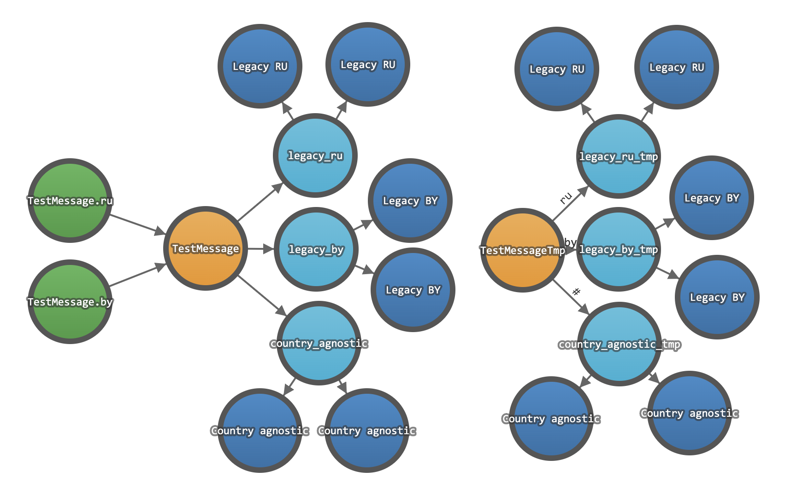
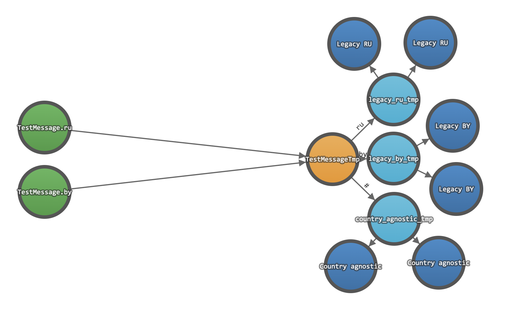
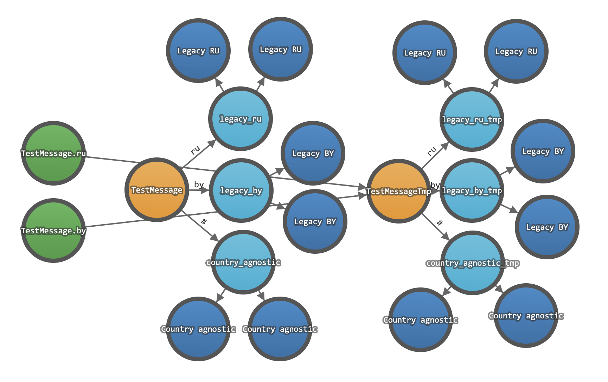
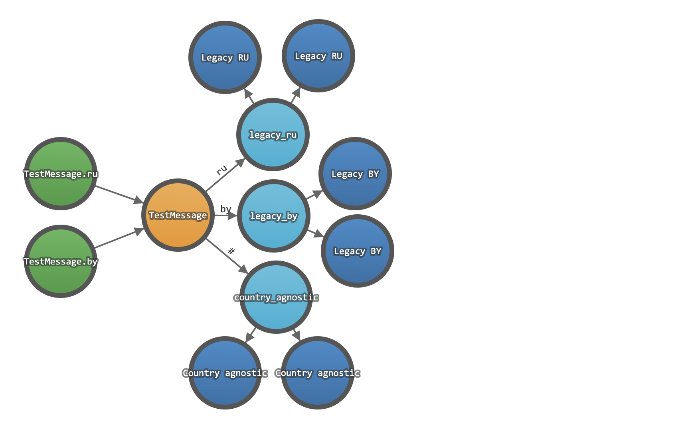

# MassTransit RabbitMQ scheme migration example

Pretty simple example of change type of exchange from fanout to topic using MassTransit.

## Getting Started

Initialize RabbitMQ
```
docker-compose up -d
```
Run consumers
```
dotnet run -p ./src/Example.Consumers
```
Run producer
```
dotnet run -p ./src/Example.Producer
```

## Steps

### Initial state


### First step
Add temporary exchange and queues for consume temporary event.


### Second step
Begin publish temporary event to temporary exchange. Stop publish original event.
Here we can easily rollback changes.


### Third step
Remove original exchanges and queues.


### Four step
Add original exchange as topic and original queues.


### Fifth step
Begin publish to new original exchange.


### Six step
Remove all tmp items.
